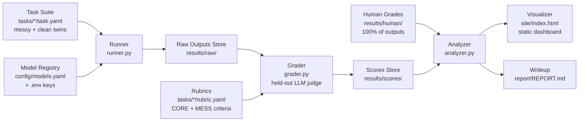

# DeskBench — Build Plan (Pilot)

A small, rigorously graded benchmark for messy real-world office work.
Model-agnostic by design. Built for $0. Every stage documented.

> **One-line pitch:** Most benchmarks test math olympiad problems. DeskBench
> tests whether a model can reconcile two messy spreadsheets or triage a
> contradictory inbox — then re-tests it on a noise-stripped *clean twin* of the
> same task to measure exactly what the mess costs, and grades everything with
> human-validated rubrics.

> **Scope note (2026-07-11 MVP pivot, aligned 2026-07-16).** This plan describes
> the **DeskBench Pilot** as actually shipped: 2 tasks × 2 variants (messy +
> clean twin) × 4 models × 3 runs, judge-graded with 100% human validation. The
> original 12-static-task plan and the "benchmark as a function" generator
> vision live in the [Roadmap](#7-roadmap-v2-the-generator-vision) section and
> [ADR-003](docs/adr/ADR-003-benchmark-as-a-function.md). Canonical step
> statuses: [BUILDSEQUENCE.md](BUILDSEQUENCE.md). Grading science:
> [docs/methodology.md](docs/methodology.md).

---

## 1. Architecture — the boxes

Strict pipeline. Each box is a standalone module with one job, a typed input,
and a typed output. No box reaches into another box's internals; they
communicate only through files on disk (versionable, inspectable, re-runnable).



| # | Box | Input | Output | One job |
|---|-----|-------|--------|---------|
| 1 | **Task Suite** | (authored by hand) | twin pairs: `task.yaml` + artifacts + reference + rubric | Define what "real office work" means — twice per task: with noise, and without |
| 2 | **Model Registry** | `models.yaml` + env vars | model client objects | Make every model a config entry, never code |
| 3 | **Runner** | tasks × models | one JSON per (task, model, run) in `results/raw/`, `variant` recorded | Execute prompts, capture everything (output, tokens, latency, errors) |
| 4 | **Grader** | raw outputs + rubrics | one score JSON per raw output in `results/scores/` | Apply rubric via the held-out LLM judge; per-criterion scores + anchor-citing rationale |
| 5 | **Human Grades** | maintainer grading of **100%** of outputs | `results/human/` | Ground truth: validates the judge AND assigns silent-vs-flagged |
| 6 | **Analyzer** | scores + human grades | `results/summary.json` + `results/tables/*.csv` | Leaderboard, **mess penalty**, **silent-failure rate**, judge–human agreement, run variance |
| 7 | **Visualizer** | `summary.json` + raw/scores | `site/index.html` (self-contained) | Static Plotly dashboard: the four pilot charts + run inspector |
| 8 | **Writeup** | summary + qualitative notes | `report/REPORT.md` | The honest analysis, including "what these results do NOT show" |

**Key invariant:** every box is re-runnable in isolation. Delete
`results/scores/` and re-run grading without re-querying models.

---

## 2. The pilot design: twin pairs and the four findings

The pilot's unit is the **twin pair**: a *messy* task (realistic noise —
superseded instructions, scheduling clashes, format mismatches, name variants)
and its *clean* twin (same core problem, noise stripped, **byte-identical
prompt** — CI-enforced — so the only thing that changes is the artifacts).

- **T01 / T01c — inbox triage** (communication). Messy adds a
  superseded-instruction trap and a calendar clash; the clean twin keeps the
  prioritization problem.
- **T02 / T02c — spreadsheet reconciliation** (data-wrangling). BOTH variants
  keep both genuine data errors (a duplicated row and a dropped zero — the
  errors ARE core); the clean twin strips only format/name/date noise.

Rubric criteria carry a `kind`: **core** (shared across the pair, identical
weights) or **mess** (messy-only). Full rationale, formulas, and the curation
judgments: [docs/methodology.md](docs/methodology.md).

The pilot reports **four things**, all computed from `results/` files:

1. **Leaderboard** — weight-normalized mean score per model, with run variance.
2. **MESS PENALTY** — per model, the core-weighted mean per-criterion score
   difference (clean − messy) across twin pairs: what the mess itself costs.
3. **SILENT-FAILURE RATE** — of wrong/incomplete answers, the fraction that
   never flagged the specific problem (human-assigned during grading).
4. **Judge–human agreement** — the judge is validated against 100% human
   grading at this scale; scores are never reported without this number.

**Run matrix: 2 tasks × 2 variants × 4 models × 3 runs = 48 completions**, plus
~48 judge calls (cached, spread over free-tier limits).

---

## 3. Repo structure (as shipped)

```
deskbench/
├── README.md                  # what/why/quickstart/status
├── BUILD_PLAN.md              # this file
├── PRD.md · DASHBOARD_SPEC.md · BUILDSEQUENCE.md · ARCHITECTURE_REVIEW.md
├── BUILD_LOG.md               # dated log of every step + decisions (never backfilled)
├── DESKBENCH_AUDIT.md         # external audit (2026-07-16) that drove the docs alignment
├── docs/
│   ├── methodology.md         # grading philosophy, twin design, mess-penalty formula
│   ├── adding-a-task.md · adding-a-model.md
│   └── adr/                   # ADR-000..003
├── config/models.yaml         # model registry — 4 leaderboard models + held-out judge
├── tasks/
│   ├── T01-inbox-triage/              # messy original
│   │   ├── task.yaml                  # variant: messy
│   │   ├── artifacts/ · reference.md  # reference written BEFORE any model run
│   │   └── rubric.yaml                # CORE + MESS criteria, weights sum to 1.0
│   ├── T01c-inbox-triage/             # clean twin: variant: clean, twin_of: T01…
│   ├── T02-spreadsheet-reconciliation/
│   └── T02c-spreadsheet-reconciliation/
├── deskbench/                 # the Python package
│   ├── schemas.py             # the four contracts (§4)
│   ├── registry.py            # models.yaml → LiteLLM; retry/backoff + response cache
│   ├── runner.py              # box 3 (records variant)
│   ├── grader.py              # box 4 (weight-normalized totals)
│   ├── analyzer.py            # box 6 (lands at Step 8)
│   ├── visualize.py           # box 7 (lands at Step 9)
│   └── cli.py                 # deskbench models / ping / run / grade (analyze / render to come)
├── results/                   # raw/ scores/ human/ COMMITTED for the pilot (chain of evidence);
│                              # tables/ + summary.json committed; response cache stays ignored
├── site/ · report/ · scripts/ · tests/
├── .env.example               # every provider key documented; no secrets in git
├── LICENSE                    # MIT
└── pyproject.toml
```

---

## 4. Tech stack (all free)

| Concern | Choice | Why |
|---|---|---|
| Language | Python 3.11+ | light coding, broad familiarity |
| Model access | **LiteLLM** | one client, any provider; models become pure config |
| Free models | Gemini Flash (Google AI Studio), GLM-4.7-Flash (Z.ai), Llama 3.3 70B (Groq), DeepSeek V3 (OpenRouter `:free`) | 4 labs, $0 |
| Judge model | Qwen2.5-72B (OpenRouter `:free`) — **held out of the leaderboard**, family-independent of all four | LLM judges favor their own family; the registry enforces independence mechanically |
| Schemas | pydantic v2 | typed contracts between boxes; `extra="forbid"` catches YAML typos |
| Config | YAML (`task.yaml`, `rubric.yaml`, `models.yaml`) | human-readable, diffable, reviewable |
| Charts | Plotly → one static HTML | interactive, zero hosting cost |
| CLI | Typer | `deskbench run --task T01 --model gemini-flash -n 3` |
| Tests | pytest | 100+ tests; schema-validates every task dir in CI |
| CI | GitHub Actions | lint + tests on push; build-status auto-updates BUILDSEQUENCE |
| Hosting | GitHub Pages | dashboard + report, free |
| Resilience | tenacity retry/backoff + on-disk response cache keyed per run | free tiers have low rate limits — non-negotiable from day one |

---

## 5. Data contracts (the box connectors)

Defined once in `schemas.py`, validated everywhere (details in the module):

**task.yaml** — `id`, `title`, `category`, `difficulty`, **`variant`
(messy | clean)**, **`twin_of`** (clean twins name their messy original —
pairing is explicit, never a naming convention), `prompt`, `artifacts[]`,
`tools_allowed[]`, `author_notes`.

**rubric.yaml** — `task_id`, **`variant`**, criteria each with `name`, `weight`,
**`kind` (core | mess)**, `description`, `anchors` for scores 1/3/5, plus
`auto_fail` conditions. Messy rubric weights sum to 1.0; a clean rubric carries
only the shared core criteria at **identical** weights (sum < 1.0; the grader
normalizes — see methodology.md).

**raw result JSON** — `task_id`, `model_id`, `run_index`, **`variant`**,
`output`, `tokens_in/out`, `latency_s`, `cost_usd` (0.0 — and we say so),
`timestamp`, `error`, `sampling` (vendor-default policy, recorded), and
**`task_hash`** (content-hash versioning: reruns never silently mix task
versions).

**score JSON** — per-criterion `score` + `judge_rationale`, `weighted_total`
(weight-normalized), `auto_fail_triggered`, `judge_model`, human-assigned
`failure_modes`, `task_hash` + `rubric_hash`, `timestamp`.

Everything content-addressed by `{task_id}__{model_id}__run{n}` so reruns never
clobber history.

---

## 6. Build sequence

The canonical, machine-checked step list — with its live status table — is
[BUILDSEQUENCE.md](BUILDSEQUENCE.md). Summary of the pilot sequence: 0
scaffolding · 1 schemas · 2 model registry · 3 pilot tasks T01/T02 (+ recorded
saturation probe) · 4 runner · 5 grader · 6 clean twins + CORE/MESS split ·
7 the 48-run pilot + judge grading · 8 100% human validation + analyzer ·
9 the pilot dashboard · 10 report & ship.

Every step ends with a dated BUILD_LOG.md entry and a commit; a step's ✅ is
computed from the repo's actual state by `scripts/build_status.py`, never
asserted by hand. Steps 7+ are gated on maintainer inputs (API keys → ping →
saturation probe → editorial pass → go).

---

## 7. Roadmap (v2): the generator vision

> **Moved here by the MVP pivot — designed, deliberately not built.** The full
> design is [ADR-003 "Benchmark as a function"](docs/adr/ADR-003-benchmark-as-a-function.md).

The pilot's twin pairs are hand-authored instances of a more general idea:
**a benchmark as a function, not a list**. Each task becomes a parameterized
template whose seeded parameter draws *change the correct answer* — which
deadline is binding, which row is duplicated, where the dropped zero lands —
with the reference answer **computed** from the drawn parameters rather than
written by hand. That buys:

- **Contamination resistance you can prove:** a model that memorized any
  released instance still fails a fresh draw, because the answer moved.
- **The messy/clean twin for free:** noise becomes a parameter axis (the
  core/noise split the pilot hand-curated becomes `noise=off`).
- **Statistical power:** n instances per template instead of n=1.

Honestly stated risk (in the ADR): if the parameter space is shallow, the
generator is a gimmick — 50 reskins of one problem. The pilot's per-task
core/noise curation is the evidence that the parameter axes can be chosen
meaningfully. v1.1 candidates additionally include an India-flavored task
slice, judge-assigned failure taxonomy (with its own agreement check), and an
[Inspect](https://inspect.aisi.org.uk/) export as an interop gesture.

---

## 8. Documentation standards

1. **BUILD_LOG.md** — dated entry per step: built / broke / decided. Written as
   the work happens, never backfilled.
2. **ADRs** — one page per non-obvious decision (000 custom pipeline, 001 files
   over DB, 002 judge prompt + independence, 003 generator roadmap).
3. **Docstrings** — every box's module states its contract: input, output,
   invariants.
4. **methodology.md** — the scientific heart: grading philosophy, twin design,
   mess-penalty formula, silent-failure definition, judge validation,
   limitations.
5. **README** — 60-second version: what, why, status, quickstart, roadmap.

---

## 9. Free-tier budget math (why this fits in $0)

Pilot run: 2 tasks × 2 variants × 4 models × 3 runs = **48 model calls**, plus
~48 judge calls (plus reject-and-retry overhead). Free daily quotas (Gemini AI
Studio, Groq, Z.ai, OpenRouter `:free`) comfortably cover this spread across 4
providers in a day; the on-disk cache means reruns cost zero calls and judge
retries never re-bill a completed grade.

---

## 10. Quality bar / anti-goals

- **No scale theater.** 2 excellent twin pairs beat 50 mediocre tasks — and the
  report's first limitation says n=2 out loud.
- **No unvalidated judge.** Judge scores are never reported without the
  human-agreement number next to them (100% human-graded at this scale).
- **No hidden failures.** Errors, refusals, and parse failures are results, not
  noise to discard; the grader never invents a score.
- **No claims beyond the data.** 4 free models ≠ "state of the art" — the
  report says exactly what was tested.
- **No hand-entered numbers.** If a number appears in the report or dashboard,
  it is computed from files in `results/`.
- **No secrets in git; the full chain of evidence IS in git** (pilot results
  committed — see BUILD_LOG 2026-07-11 policy note).
