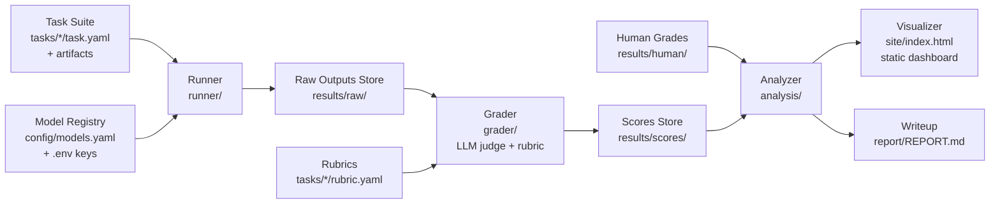

# DeskBench — Build Plan

A small, rigorously graded benchmark for messy real-world office work.
Model-agnostic by design. Built for $0. Every stage documented.

> **One-line pitch:** Most benchmarks test math olympiad problems. DeskBench tests whether a model can reconcile two messy spreadsheets, triage a contradictory inbox, or draft a report from conflicting notes — and grades it with validated rubrics.

---

## 1. Architecture — the boxes

Strict pipeline. Each box is a standalone module with one job, a typed input, and a typed output. No box reaches into another box's internals; they communicate only through files on disk (versionable, inspectable, re-runnable).



| # | Box | Input | Output | One job |
|---|-----|-------|--------|---------|
| 1 | **Task Suite** | (authored by hand) | `task.yaml` + artifact files + reference answer | Define what "real office work" means, concretely |
| 2 | **Model Registry** | `models.yaml` + env vars | model client objects | Make every model a config entry, never code |
| 3 | **Runner** | tasks × models | one JSON per (task, model, run) in `results/raw/` | Execute prompts/agent loops, capture everything (output, tokens, latency, tool calls, errors) |
| 4 | **Grader** | raw outputs + rubrics | one score JSON per raw output in `results/scores/` | Apply rubric via LLM judge; record per-criterion scores + judge rationale |
| 5 | **Human Grades** | your manual grading of a sample | `results/human/*.json` | Ground truth to validate the judge (agreement rate) |
| 6 | **Analyzer** | scores + human grades | `results/summary.json` + `results/tables/*.csv` | Aggregate: leaderboard, per-category, variance, judge agreement, cost/latency, failure taxonomy |
| 7 | **Visualizer** | `summary.json` | `site/index.html` (self-contained) | Static Plotly dashboard — no server, hosts on GitHub Pages |
| 8 | **Writeup** | summary + your qualitative notes | `report/REPORT.md` | The honest analysis, including "what these results do NOT show" |

**Key invariant:** every box is re-runnable in isolation. Delete `results/scores/` and re-run grading without re-querying models. This is what makes "evaluate a new model in one command" true.

---

## 2. Repo structure

```
deskbench/
├── README.md                  # what/why/quickstart/results screenshot
├── BUILD_LOG.md               # dated log of every build step + decisions
├── docs/
│   ├── PRD.md                 # one-page goals / non-goals / success criteria
│   ├── dashboard-spec.md      # visualizer UX: layout, chart inventory, interactions
│   ├── architecture.md        # this diagram + box contracts (doubles as the TRD)
│   ├── methodology.md         # grading philosophy, judge validation, limitations
│   ├── adding-a-task.md       # how to author a task + rubric
│   ├── adding-a-model.md      # 5-line guide: edit models.yaml, set env var, run
│   └── adr/                   # Architecture Decision Records (ADR-001, 002…)
├── config/
│   └── models.yaml            # model registry — THE env-var insight, materialized
├── tasks/
│   └── T01-inbox-triage/
│       ├── task.yaml          # id, category, prompt, artifact list, tool needs
│       ├── artifacts/         # emails.md, data.csv, notes.docx …
│       ├── reference.md       # what a competent human produces (written BEFORE any model run)
│       └── rubric.yaml        # weighted criteria + 1/3/5 scoring anchors
├── deskbench/                 # the Python package
│   ├── schemas.py             # pydantic models for task/rubric/result/score
│   ├── registry.py            # loads models.yaml → LiteLLM clients
│   ├── runner.py              # box 3
│   ├── grader.py              # box 4
│   ├── analyzer.py            # box 6
│   ├── visualize.py           # box 7 (writes site/index.html)
│   └── cli.py                 # deskbench run / grade / analyze / render / all
├── results/                   # raw/ scores/ human/ tables/ summary.json (gitignored raw, committed summary)
├── site/                      # generated dashboard → GitHub Pages
├── report/REPORT.md
├── tests/                     # schema validation, grader parsing, analyzer math
├── .env.example               # every key documented, no secrets committed
├── LICENSE                    # MIT
└── pyproject.toml
```

---

## 3. Tech stack (all free)

| Concern | Choice | Why |
|---|---|---|
| Language | Python 3.11+ | job posting: "light coding… python proficiency" |
| Model access | **LiteLLM** | one client, any provider; models become pure config |
| Free models | Gemini Flash (Google AI Studio), GLM-4.7-Flash (Z.ai), Llama 3.x 70B (Groq), DeepSeek (OpenRouter `:free`) | 4 labs, $0 |
| Judge model | a capable free model **held out of the leaderboard** (judge independence); local Ollama as fallback for rubric iteration | LLM judges favor their own model family — never let the judge grade itself. If free tiers force overlap, run an explicit self-preference check and report it |
| Schemas | pydantic v2 | typed contracts between boxes; self-documenting |
| Config | YAML (`task.yaml`, `rubric.yaml`, `models.yaml`) | human-readable, diffable, reviewable |
| Charts | Plotly → embedded in one static HTML | interactive, zero hosting cost |
| CLI | Typer | `deskbench all --model gemini-flash` demo-ability |
| Tests | pytest | credibility; run in CI |
| CI | GitHub Actions (free) | lint + tests + schema-validate all tasks on push |
| Hosting | GitHub Pages | dashboard + report, free |
| Resilience | tenacity (retry/backoff) + on-disk response cache | free tiers have low rate limits — non-negotiable from day one |

**Note on Antigravity / agentic IDEs:** tools like Google Antigravity are things you build *with*, not part of the deliverable — using one is fine (and worth a line in BUILD_LOG.md about your AI-assisted workflow, which the job explicitly values), but the repo must stand on its own. The visual appeal comes from the dashboard, the Mermaid diagrams in docs, and the README — not the IDE.

---

## 4. Data contracts (the box connectors)

Defined once in `schemas.py`, validated everywhere. Summary:

**task.yaml** — `id`, `title`, `category` (one of: communication, data-wrangling, synthesis, planning, compliance), `difficulty`, `prompt`, `artifacts[]`, `tools_allowed[]`, `author_notes`.

**rubric.yaml** — list of criteria, each with `name`, `weight` (sum = 1.0), `description`, and `anchors` for scores 1/3/5 ("what does silently dropping a constraint look like vs. flagging the ambiguity"). Plus `auto_fail` conditions (e.g., fabricated data).

**raw result JSON** — `task_id`, `model_id`, `run_index`, `output`, `tool_trace[]`, `tokens_in/out`, `latency_s`, `cost_usd` (0.0 — and say so), `timestamp`, `error`.

**score JSON** — per-criterion `score` + `judge_rationale`, `weighted_total`, `auto_fail_triggered`, `judge_model`, `rubric_version`.

Everything content-addressed by `{task_id}__{model_id}__run{n}` so reruns never clobber history.

---

## 5. Build sequence — step by step

Each step has a **Definition of Done (DoD)** and ends with a commit + a dated entry in `BUILD_LOG.md`. No step starts before the previous one's DoD is met. This build log IS your documentation story.

**Step 0 — Repo & scaffolding** (0.5 day)
Init repo, folder structure, `pyproject.toml`, `.env.example`, pre-commit (ruff), empty CI workflow, README skeleton with architecture diagram.
*DoD: CI green on empty package; README explains the idea in 10 lines.*

**Step 1 — Schemas first** (0.5 day)
Write `schemas.py` (all four contracts) + tests that load example YAML/JSON fixtures. Write ADR-001: "files-on-disk pipeline over a database — why."
*DoD: `pytest` green; a malformed task.yaml fails validation with a readable error.*

**Step 2 — Model registry** (0.5 day)
`models.yaml` + `registry.py` via LiteLLM. Entries for the 4 free models; keys from env vars only. Retry/backoff + response cache built in HERE, not later. Write `docs/adding-a-model.md`.
*DoD: `deskbench ping` gets a hello from all 4 providers; second call hits cache.*

**Step 3 — Two pilot tasks + rubrics** (1–1.5 days)
Author T01 (inbox triage with conflicting requests) and T02 (spreadsheet reconciliation with format mismatches): artifacts, **reference answer written before any model run** (state this discipline in methodology.md), and rubrics with real 1/3/5 anchors. Write `docs/adding-a-task.md` from what you learn.
*DoD: both tasks pass schema validation; a colleague-level reader could grade a human answer using only the rubric.*
**Saturation check:** run both pilot tasks against 2 models before scaling. If everything scores ≥4/5, the tasks are too easy and the benchmark measures nothing — raise difficulty (more ambiguity, conflicting constraints, dirtier data) before Step 6.

**Step 4 — Runner** (1 day)
`runner.py`: task × model × N runs → raw JSONs. Tool use is scoped hard: **exactly 2 of the 12 tasks** use tools (file reading + code exec) in v1; all others are self-contained (artifacts inlined into the prompt). Agent loops multiply failure modes — contain them. CLI: `deskbench run --task T01 --model gemini-flash -n 3`.
*DoD: 2 tasks × 4 models × 3 runs = 24 raw results on disk, resumable after an interrupt.*

**Step 5 — Grader** (1–1.5 days)
`grader.py`: LLM judge receives rubric + reference + model output, returns structured per-criterion scores with rationale (enforce JSON schema on judge output; reject-and-retry on parse failure). Judge instruction: grade against the rubric anchors, NOT similarity to the reference — valid alternative approaches must not be penalized. ADR-002: judge prompt design + judge-independence policy (judge model is excluded from the leaderboard).
*DoD: 24 score files; spot-read 5 rationales — they cite the rubric anchors, not vibes.*

**Step 6 — Full task suite** (3–4 days, the real work)
Scale to **12 generic tasks** across the 5 categories (India-flavored slice deferred to v1.1 — note this in the roadmap section of README). Iterate rubrics using a local/cheap judge to save rate limits.
*DoD: 12 tasks, 12 rubrics, all validated; category coverage table in docs.*

**Step 7 — Human grading & judge validation** (1–1.5 days)
Hand-grade a stratified sample (≥30% of outputs, blind to judge scores) → `results/human/`. Analyzer computes judge–human agreement (correlation + mean absolute difference per criterion). If agreement is weak, fix rubrics/judge prompt and re-run — and KEEP the before/after numbers; that iteration story is gold for the writeup.
*DoD: agreement metrics computed and honest; methodology.md updated with the number, whatever it is.*

**Step 8 — Full run & analysis** (1 day)
All 12 tasks × 4 models × 3–5 runs (cache + backoff make this feasible on free tiers; spread over a day if needed). `analyzer.py` → summary.json: leaderboard, per-category scores, run-to-run variance, judge agreement, latency, failure-mode taxonomy (tag each low score: hallucinated data / dropped constraint / false confidence / format failure / refusal).
*DoD: summary.json complete; every number in it reproducible from raw files.*

**Step 9 — Visualizer** (1–1.5 days)
`visualize.py` → single self-contained `site/index.html` (Plotly): leaderboard bars with variance whiskers; model × task score heatmap; per-category radar/grouped bars; run-variance box plots; judge-vs-human scatter; failure-mode breakdown; and a **run inspector** — click a cell, see the model's actual output next to the reference and the judge rationale (the "logs" you wanted, made browsable). Publish to GitHub Pages.
*DoD: one HTML file, opens from disk with no server, every chart labeled and self-explanatory.*

**Step 10 — Writeup & ship** (1.5–2 days)
`report/REPORT.md`: method → results → 3 surprising findings → failure modes → **"What these results do NOT show"** → limitations & next steps (incl. v1.1 India slice, more models via one-line config). Polish README (add dashboard screenshot). Final BUILD_LOG entry. Then the LinkedIn/X post (findings-first draft already agreed), and apply to Epoch with the repo linked.
*DoD: a stranger can go from README → dashboard → report → any raw log file and follow the whole chain of evidence.*

**Total: ~12–15 working days part-time.**

---

## 6. Documentation standards (meticulous, as requested)

1. **BUILD_LOG.md** — dated entry per step: what was built, what broke, what was decided. Written as you go, never backfilled.
2. **ADRs** — one page per non-obvious decision (files vs DB, judge prompt design, why free models don't weaken the research, why reference answers precede model runs).
3. **Docstrings + module READMEs** — every box's module states its contract: input, output, invariants.
4. **methodology.md** — the scientific heart: grading philosophy, judge validation protocol, contamination note (synthetic tasks authored fresh → can't be in training data), limitations.
5. **README** — 60-second version: what, why, screenshot, quickstart (`pip install -e . && deskbench all`), results table, roadmap.

---

## 7. Job-criteria traceability

| Job requirement | Where DeskBench proves it |
|---|---|
| Curate an evaluation suite | 12 authored tasks + `adding-a-task.md` + roadmap |
| Devise rubrics for hard-to-grade tasks | `rubric.yaml` anchors + methodology.md |
| Evaluate AI systems regularly | model registry + `deskbench all --model X` (one-line addition) |
| Communicate research | REPORT.md + dashboard + LinkedIn/X post |
| Data analysis | analyzer: variance, agreement stats, failure taxonomy |
| Improve the process | caching, CI, resumable runs, one-command pipeline |
| Grounded, skeptical mentality | judge validation + "what this does NOT show" section |
| Comfort with AI agents | runner tool-use + LLM judge + AI-assisted workflow noted in BUILD_LOG |

---

## 8. Free-tier budget math (why this fits in $0)

Full run: 12 tasks × 4 models × 4 runs = **192 model calls**, plus ~192 judge calls, plus rubric-iteration overhead (done on local Ollama, $0 and unlimited). Free daily quotas (Gemini AI Studio, Groq, Z.ai Flash, OpenRouter `:free`) comfortably cover ~100–200 calls/day per provider, and calls are spread across 4 providers — so a full run fits in 1–2 days, and the on-disk cache means reruns cost zero calls. Budget the calendar accordingly: Step 8 is "spread over two days," not "one afternoon."

---

## 9. Quality bar / anti-goals

- **No scale theater.** 12 excellent tasks beat 50 mediocre ones. Rubric quality is the differentiator.
- **No unvalidated judge.** Never report judge scores without the human-agreement number next to them.
- **No hidden failures.** Errors, refusals, and parse failures are results, not noise to discard.
- **No claims beyond the data.** 4 free models ≠ "state of the art" — say exactly what was tested and why.
- **No secrets in git, no results you can't reproduce.**

---

## Next actions

1. You create the GitHub repo and send me the link.
2. I scaffold Step 0–1 (structure, schemas, CI) in your project folder.
3. We author T01 together so the task/rubric pattern is set, then I can draft further task artifacts for your review — you stay the editorial voice, since the curation judgment is what you're showcasing.
