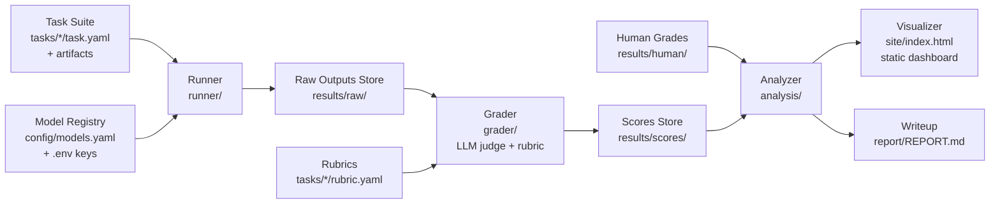

# DeskBench

**A rigorously graded benchmark for messy real-world office work.**

> Most benchmarks test math-olympiad problems. DeskBench tests whether a model
> can reconcile two messy spreadsheets or triage a contradictory inbox — then
> re-tests it on a noise-stripped **clean twin** of the same task to measure
> exactly what the mess costs, and grades it with human-validated rubrics.

Public AI benchmarks over-index on exams and code. Almost none measure the
ambiguous, judgment-heavy tasks that make up real office work, and none isolate
what realistic *mess* costs a model. **DeskBench Pilot** is a deliberately
small, open, reproducible benchmark: **2 office tasks, each shipped as a twin
pair** (messy original + clean twin with a byte-identical prompt), run across
**4 free models × 3 runs**, judge-graded and **100% human-validated**, for
**$0**. It reports four things: a leaderboard, the **mess penalty**, the
**silent-failure rate**, and judge–human agreement. Small on purpose — the
pilot proves the method; scale comes from the
[generator roadmap](docs/adr/ADR-003-benchmark-as-a-function.md).

- **Twinned** — every task has a clean twin; comparing the pair isolates the
  cost of the mess from the cost of the work
  ([methodology](docs/methodology.md)).
- **Model-agnostic** — every model is a config line (LiteLLM); adding one is a
  one-line change.
- **Reproducible** — boxes communicate only through typed files on disk; delete
  a stage's output and re-run it in isolation.
- **Auditable** — pilot results are committed, so every number traces back to a
  raw model output in the repo.
- **Honest** — judge scores are never reported without the human-agreement
  number beside them, the first stated limitation is **n = 2 tasks**, and the
  writeup includes a "what these results do **not** show" section.

## Architecture

A strict pipeline. Each box has one job, a typed input, and a typed output, and
reaches into no other box's internals.



| # | Box | One job |
|---|-----|---------|
| 1 | **Task Suite** | Define what "real office work" means, concretely |
| 2 | **Model Registry** | Make every model a config entry, never code |
| 3 | **Runner** | Execute prompts, capture output / tokens / latency / errors |
| 4 | **Grader** | Apply the rubric via an LLM judge; record per-criterion scores + rationale |
| 5 | **Human Grades** | Ground truth to validate the judge (agreement rate) |
| 6 | **Analyzer** | Aggregate: leaderboard, variance, judge agreement, failure taxonomy |
| 7 | **Visualizer** | Static Plotly dashboard — no server, hosts on GitHub Pages |
| 8 | **Writeup** | The honest analysis, including what the results do not show |

**Key invariant:** every box is re-runnable in isolation. Delete
`results/scores/` and re-grade without re-querying any model.

## Results

The pilot has run: 48 completions, judge-graded and 100% human-validated.

- **[Interactive dashboard](https://newai25.github.io/deskbench/site/)** —
  leaderboard (judge vs human), mess penalty, silent-failure rate, judge–human
  agreement, and a run inspector showing every raw output next to its
  reference, judge rationale, and human grade.
- **[The report](report/REPORT.md)** — method, all computed numbers, findings,
  and "What these results do NOT show" (starting with n = 2 tasks).
- Every number is computed from the committed evidence under
  [`results/`](results/) by `deskbench analyze` — nothing is hand-entered.

## Quickstart

```bash
git clone https://github.com/NewAi25/deskbench.git
cd deskbench
python -m venv .venv && source .venv/bin/activate   # Windows: .venv\Scripts\activate
pip install -e ".[dev]"
pytest                        # full suite, incl. hand-computed fixtures for the analyzer math
deskbench analyze             # results/ -> summary.json + tables (no keys needed)
deskbench render              # -> site/index.html (open it in a browser)
```

To re-run models yourself: `cp .env.example .env`, add provider keys, then
`deskbench ping`, `deskbench run`, `deskbench grade`.

## Project status

Built in numbered steps, each with a machine-checked Definition of Done. The
status table in [BUILDSEQUENCE.md](BUILDSEQUENCE.md) is rewritten automatically
by a GitHub Action on every push — a step flips to ✅ only when its artifacts
actually exist and its tests actually pass. All pilot steps are complete.

## Documentation

- [PRD.md](PRD.md) — goals, non-goals, success criteria (pilot scope)
- [BUILD_PLAN.md](BUILD_PLAN.md) — architecture, twin design, tech stack, data contracts
- [docs/methodology.md](docs/methodology.md) — grading philosophy, mess-penalty formula, silent-failure definition
- [ARCHITECTURE_REVIEW.md](ARCHITECTURE_REVIEW.md) — design review + required fixes
- [DESKBENCH_AUDIT.md](DESKBENCH_AUDIT.md) — external audit (2026-07-16) that drove the docs alignment
- [DASHBOARD_SPEC.md](DASHBOARD_SPEC.md) — dashboard UX spec (pilot: four charts + run inspector)
- [BUILD_LOG.md](BUILD_LOG.md) — dated log of every build step and decision
- [docs/adr/](docs/adr/) — Architecture Decision Records

## Roadmap

- **v1 (this pilot)** — 2 task pairs (messy + clean twin), 4 free models,
  3 runs, 100% human-validated judge, dashboard + report.
- **v2 — the benchmark as a function** ([ADR-003](docs/adr/ADR-003-benchmark-as-a-function.md)):
  parameterized task templates whose seeded draws change the correct answer,
  with programmatically computed references — provable contamination
  resistance, twins for free (noise as a parameter), and real statistical
  power. Designed; deliberately not built until the pilot's method is
  validated.
- **v1.1 candidates** — India-flavored task slice; judge-assigned failure-mode
  taxonomy (with its own agreement check); optional port of tasks to
  [Inspect](https://inspect.aisi.org.uk/) format as an interop gesture.

## License

[MIT](LICENSE).
